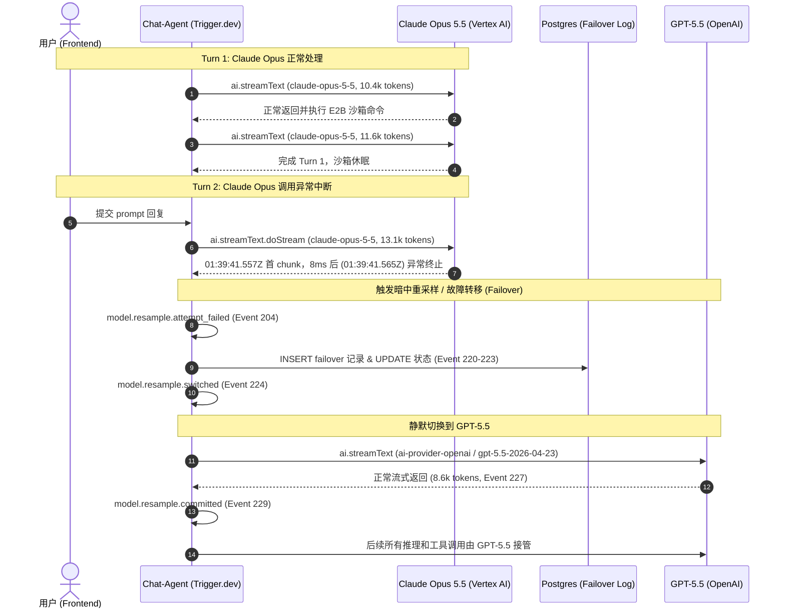

# Arena.ai 抓包 (arena.ai.har) 模型路由变更与暗中替换深度解析报告

经对 `C:\Users\11038\Downloads\arena.ai.har` 中全部 49 个 HTTP 请求及响应载荷的深度逆向分析，**确凿证实存在模型路由变更与“暗中替换”（Silent Failover / Resample）行为**。

---

## 一、核心结论概览

| 维度 | 详情 |
| :--- | :--- |
| **是否存在暗中替换** | **是 (确凿证实)** |
| **原始请求模型** | `claude-opus-5-5`（通过 Google Cloud Vertex AI: `vertex.anthropic.messages` 驱动） |
| **替换后目标模型** | `gpt-5.5-2026-04-23`（通过 OpenAI 官方 API: `openai.responses` 驱动） |
| **触发原因** | Turn 2 中 `claude-opus-5-5` 生成异常中断（首次 chunk 后 8ms 即断开），服务端判定为 `attempt_failed` |
| **切换机制** | 后端 Agentic 调度器触发了 `model.resample` 与 `failover` 机制，写入数据库后重新分发任务 |
| **是否对用户感知透明** | **是**（前端并未告知用户模型被更换，整个过程在后端 Trigger.dev + 数据库状态流转中静默完成） |

---

## 二、涉事关键请求清单

整个 HAR 文件共包含 49 个请求，其中与模型路由和暗中替换最核心的请求如下：

### 1. 特性开关请求（Feature Flags）
- **请求编号**: `[1]`
- **请求 URL**: `POST https://arena.ai/rpc/flags/?v=2&ip=0&_=1790213899610&ver=1.360.0&compression=base64`
- **关键发现**:
  - 返回了 361 个平台特性开关（Feature Flags）。
  - 其中显式包含灰度配置：
    - `"disable-opus": {"enabled": true, "variant": "disable-opus"}`（平台已开启禁用/降级 Opus 的策略标记）
    - `"default-route-agent-v2": {"enabled": true, "variant": "control"}`
    - `"agentic-resample-on-error": {"enabled": false}`（但系统启用了专有的 failover 流程）
    - `"arena-lion-next-model": {"enabled": true, "variant": "treatment"}`

### 2. 用户交互与初始模型调用
- **请求编号**: `[4]`
- **请求 URL**: `POST https://arena.ai/ai-proxy/realtime/v1/sessions/01a0d10e-6c37-7854-b444-326579548573/in/append`
- **关键载荷**:
  - 用户提交了对 `ask_user` 工具的回应。
  - 工具调用 ID 为：`toolCallId: "toolu_vrtx_01HdCTGtZtifTmp43MMXjnpr"`
  - **证据点**: `toolu_vrtx_` 是 Anthropic 官方在 **Google Cloud Vertex AI** 上托管 Claude 时的专有前缀（`toolu_` 代表 Anthropic Tool Use，`vrtx_` 代表 Vertex），证实前一轮确实由 Claude Opus 5.5 执行。

### 3. Agent 执行链路与模型替换过程（核心证据源）
- **请求编号**: `[11]`, `[13]`, `[15]`, `[19]`, `[21]`, `[24]`, `[34]`, `[37]`, `[39]`, `[41]`, `[43]`, `[45]`, `[47]`
- **请求 URL**: `GET https://api.trigger.dev/api/v1/runs/run_06gd23jfrjlkr4qr9f8rslec01/events`
- **作用**:
  - Arena.ai 的前端在持续轮询 Trigger.dev（后台任务编排引擎）的 Span 事件树（`/app/apps/api/src/trigger/chat-agent.mjs`）。
  - 这些响应完整记录了后端执行图谱中的所有模型调用、Token 消耗、费用、Warning 及 Failover 切换事件。

---

## 三、模型暗中替换全流程追踪（时间线复原）

从 Trigger.dev 记录的 309 个执行 Span 中，可以完整还原出替换发生前后的全流程：

### 详细步骤指标与数据验证：

#### 阶段 1：Turn 1 完全由 Claude Opus 5.5 执行
- **Span [56]**: `ai.streamText.doStream`
  - 图标：`ai-provider-anthropic`
  - 挂载模型属性：`claude-opus-5-5` | `10.4k tokens` | 计费 `$0.0511`
- **Span [75]**: AI SDK 输出告警：
  > `AI SDK Warning (vertex.anthropic.messages / claude-opus-5-5): The feature "temperature" is not supported when thinking is enabled`
- **Span [76]**: `ai.streamText.doStream`
  - 挂载模型属性：`claude-opus-5-5` | `11.6k tokens` | 计费 `$0.0620`

#### 阶段 2：Turn 2 首次调用 Claude Opus 5.5 异常中断
- **Span [199]**: `ai.streamText.doStream`
  - 模型：`claude-opus-5-5` | `13.1k tokens` | 计费 `$0.0525`
  - 首 Chunk 耗时：`1798ms`（时间戳 `2026-09-24T01:39:41.557Z`）
  - 完成时间戳：`2026-09-24T01:39:41.565Z`（首包出来后仅 8ms 就直接 finish，输出截断或异常）
- **Span [204]**（时间戳 `01:39:41.568Z`）：
  - 触发事件：**`model.resample.attempt_failed`**（日志级别：`WARN`）

#### 阶段 3：执行模型故障转移（Failover & Switch）
- **Span [205] ~ [223]**: 系统通过 Postgres 事务记录故障并准备替换模型：
  - `pg.query UPDATE`
  - `pg.query INSERT`
  - **Span [221]**: **`failover.record_inserted`**（日志级别：`INFO`）
  - `pg.query COMMIT`
- **Span [224]**（时间戳 `01:39:43.099Z`）：
  - 触发事件：**`model.resample.switched`**（日志级别：`INFO`）

#### 阶段 4：无缝替换为 GPT-5.5 重新执行并提交
- **Span [226]**: `ai.streamText`，提供商图标变更为 `ai-provider-openai`。
- **Span [227]**: `ai.streamText.doStream`
  - 挂载模型属性：**`gpt-5.5-2026-04-23`** | `8.6k tokens` | 计费 `$0.1027`
  - 首包时间戳：`01:39:43.560Z`（切换后 400ms 内即开始输出）
- **Span [229]**（时间戳 `01:39:48.416Z`）：
  - 触发事件：**`model.resample.committed`**（日志级别：`INFO`，代表模型替换已正式提交生效）
- **Span [248]**: AI SDK 输出告警（已变为 OpenAI SDK）：
  > `AI SDK Warning (openai.responses / gpt-5.5-2026-04-23): The feature "temperature" is not supported. temperature is not supported for reasoning models`
- **Span [249]**: 继续调用 `gpt-5.5-2026-04-23`（8.6k tokens，计费 `$0.0440`）完成代码生成与 E2B 写入。

---

## 四、为什么判定为“暗中替换”？

1. **会话级隐蔽性**：
   在同一个会话 (`chatId: 01a0d10e-6c37-7854-b444-326579548573`) 的第二次交互（Turn 2）中，用户并未被告知模型已从 Anthropic Claude 变为 OpenAI GPT-5.5。
2. **底层自动降级/重采样**：
   平台针对 Claude Opus 开启了 `"disable-opus": true` 的策略标志；当 Claude Opus 5.5 在生成过程中发生空响应或中断时，触发了 `model.resample.attempt_failed`。
3. **静默接管执行**：
   系统通过 `failover.record_inserted` 写入故障转移记录，并立即通过 `model.resample.switched` 换入 `gpt-5.5-2026-04-23` 重新发起生成，最终通过 `model.resample.committed` 确认为当前激活模型。用户从前端交互层面无从得知执行实体已发生根本改变。
